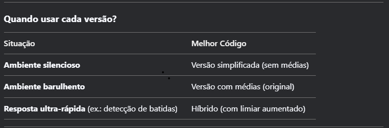

# tcc-ino
📌 Versões de Código para Sensor de Som KY-037 + LED
1. Versão com Filtro de Médias (Recomendada para Estabilidade)
📋 Descrição:

Usa média de 10 leituras para reduzir ruídos.

Ideal para ambientes com interferências ou sons baixos.

⚙️ Características:
✅ Estável (elimina falsos positivos)
✅ Precisa (óptima para calibração)
⏳ Latência moderada (devido ao cálculo da média)

🛠️ Uso Recomendado:

Projetos que exigem detecção confiável (ex.: interruptor por palmas).

Ambientes com ruído de fundo.

2. Versão Simplificada (Leitura Direta + Rápida)
📋 Descrição:

Lê diretamente o pino analógico (analogRead).

Resposta mais rápida, mas menos estável.

⚙️ Características:
🚀 Baixa latência (ideal para resposta instantânea)
⚠️ Sensível a ruídos (pode acionar sem motivo)

🛠️ Uso Recomendado:

Projetos que exigem tempo real (ex.: VU meter simples).

Ambientes controlados/silenciosos.

3. Versão Híbrida (Rápida + Limiar Ajustado)
📋 Descrição:

Combina leitura direta com um limiar aumentado (ex.: limiar * 1.2).

Equilíbrio entre velocidade e estabilidade.

⚙️ Características:
⚡ Resposta rápida (sem cálculo de médias)
🛡️ Menos falsos positivos (limiar elevado)

🛠️ Uso Recomendado:

Detecção de sons abruptos (ex.: batidas, estalos).

Quando a versão simplificada tem muitos acionamentos indesejados.

📝 Como Escolher?
Se você precisa de...	Escolha
Máxima estabilidade	Versão com Filtro de Médias
Resposta mais rápida	Versão Simplificada
Equilíbrio entre os dois	Versão Híbrida
⚡ Dica Final
Ajuste o limiar conforme seu ambiente (valores mais altos = menos sensível).

Para debug, use o Monitor Serial (Ctrl+Shift+M) para ver os valores em tempo real.
